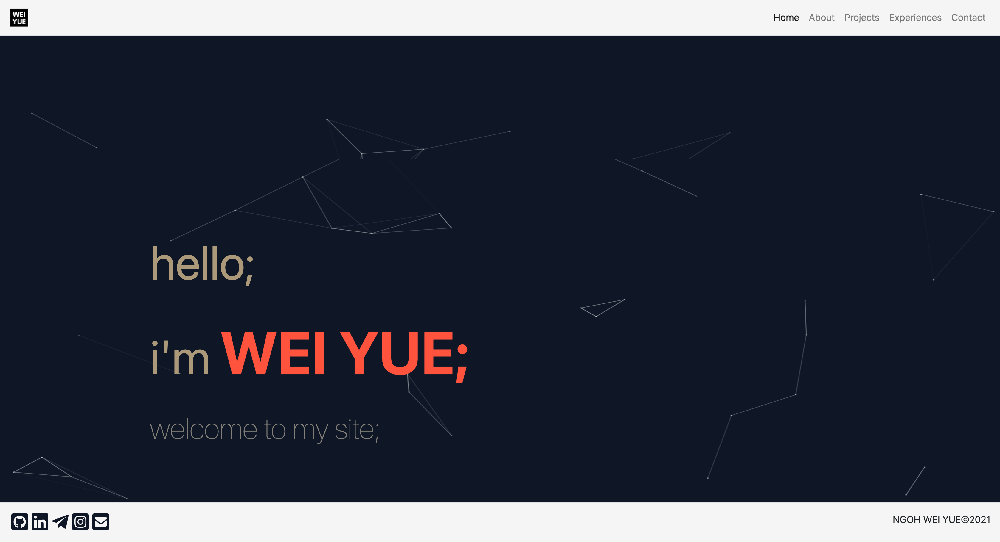

# Personal Portfolio Website v2.0

My personal portfolio website that contains some information about me and the projects that I did.
[Check me out!](https://nweiyue.github.io/portfolio/#/)

## Built With

* HTML
* CSS
* JavaScript
* [React.js](https://reactjs.org)
* [Node.js](https://nodejs.org/en/)
* [React Bootstrap](https://react-bootstrap.github.io)

## Authors

* [Ngoh Wei Yue](https://github.com/nweiyue)

## License

This project is licensed under the MIT License - see the [LICENSE](./LICENSE) file for details

## Acknowledgments

* Navigation links from [React Router](https://reactrouter.com)
* Background of home page from [Particles.js](https://github.com/VincentGarreau/particles.js/)
* Image of Kobe Bryant from [Lakers Nation](https://lakersnation.com/top-10-kobe-bryant-los-angeles-lakers-playoff-moments/2020/01/26/)
* Icons from [Font-Awesome](https://fontawesome.com)
* Icons from [react-social-icons](https://jaketrent.github.io/react-social-icons/)
